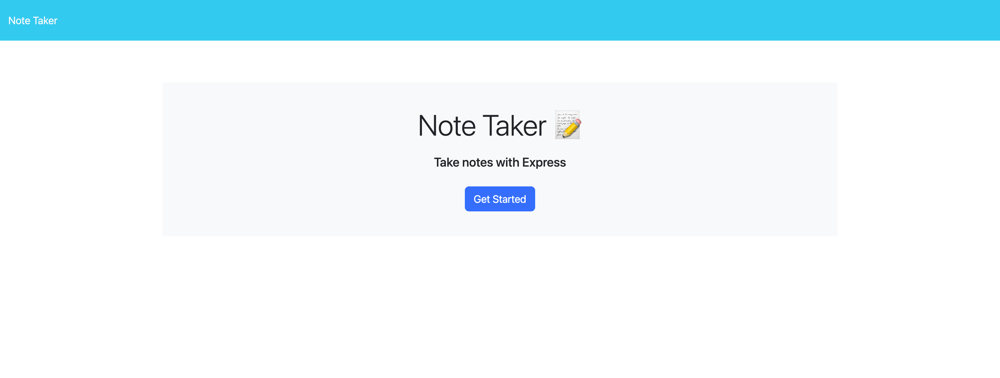
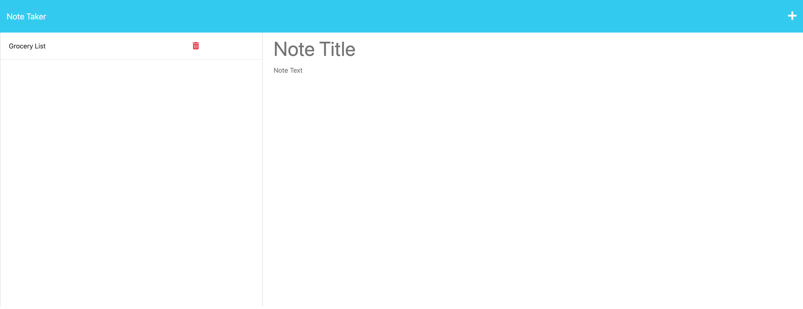
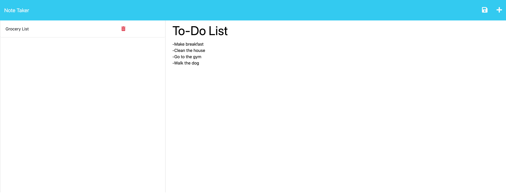
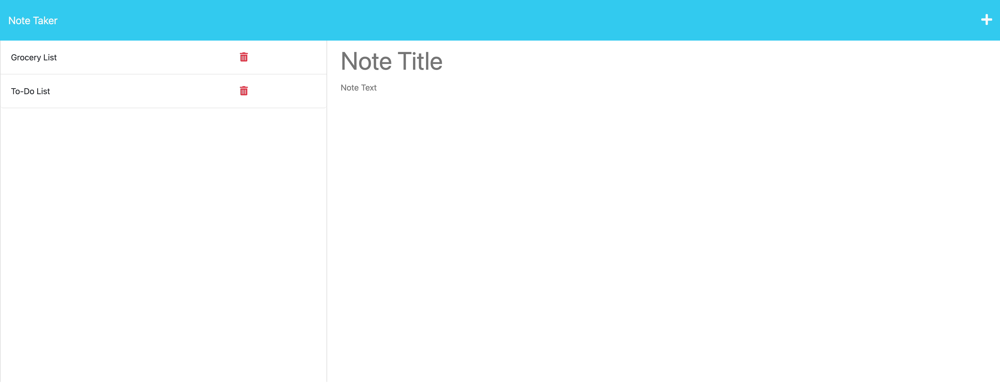

# Note-Taker

## Description

The task at hand was to modify starter code to create an application called Note Taker that can be used to write and save notes. The application application will use an Express.js back end and will save and retrieve note data from a JSON file. This project was built to help users organize their thoughts and keep track of tasks that required completion. This is achieved by allowing the users to write down any of their notes and have the aility to save it on the server.

## Usage

The objectives that were completed to fulfill in creating a Note Taker app are as follows...

- Displaying a landing page with a link to a notes app
- Present existing notes that the user has saved on the server
- Allow for new notes to be made and saved on the server

## Screenshots

### Landing Page

### Interface with the existing note

### New note being created and saved

## URL of GitHub repository

https://github.com/matthewzmija/Note-Taker

## URL of the deployed application

https://sheltered-crag-48593.herokuapp.com/

## License

MIT
